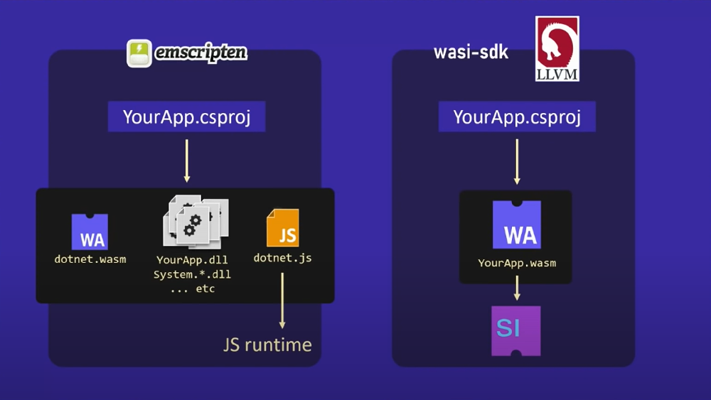
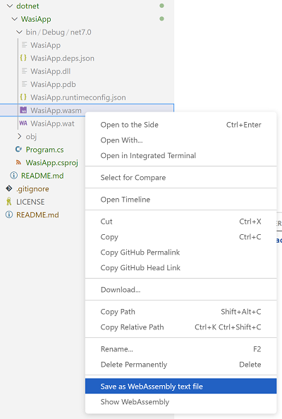

# dotnet

This directory contains a project that uses a preview version of dotnet to build an application as a WebAssembly binary (.wasm).

Typically, dotnet + WebAssembly makes developers think of web applications in the browser like Blazor.

This effort instead looks at using dotnet to run server-side applications that make use of the WebAssembly System Interface ([WASI](https://github.com/WebAssembly/WASI)) APIs with a WebAssembly runtime like [wasmtime](https://github.com/bytecodealliance/wasmtime).

This contrast is well illustrated by Steve Sanderson in his talk from Build 2022:

[](https://www.youtube.com/watch?v=A0vz_BWxIMc)

## Supporting Talk

See this video by Steve why this is valuable for building cross-platform and highly-available services in dotnet: <https://www.youtube.com/watch?v=A0vz_BWxIMc/>

## Development Tools

The tools you need for this project are bundled in a DevContainer. 

See the [root README](../README.md#development-tools) for instructions on opening this project.

## Building the WebAssembly Binary

To build a `.wasm` binary, the [WasiApp.csproj](WasiApp.csproj) uses two preview dotnet features.

1. First, it uses a preview version of the .NET 7 SDK (specifically 7.0.100-preview.7.22377.5):

    ```xml
    <TargetFramework>net7.0</TargetFramework>
    ```

1. And, it uses the pre-release NuGet Package [Wasi.Sdk](https://www.nuget.org/packages/Wasi.Sdk/0.1.1):

    ```xml
    <PackageReference Include="Wasi.Sdk" Version="0.1.2-preview.10061" />
    ```

With those two preview dependencies, you can compile a WebAssembly binary (`.wasm`) from a dotnet application with `dotnet build`.

1. Navigate to the `WasiApp` directory:

    ```plaintext
    cd WasiApp
    ```

1. Build the project:

    ```plaintext
    dotnet build
    ```

1. You should see output similar to:

    ```plaintext
    MSBuild version 17.4.0-preview-22368-02+c8492483a for .NET
    Determining projects to restore...
    All projects are up-to-date for restore.
    /usr/local/dotnet/7.0.100-preview.7.22377.5/sdk/7.0.100-preview.7.22377.5/Sdks/Microsoft.NET.Sdk/targets/Microsoft.NET.RuntimeIdentifierInference.targets(219,5): message NETSDK1057: You are using a preview version of .NET. See: https://aka.ms/dotnet-support-policy [/workspaces/explore-dotnet-wasi/dotnet/WasiApp/WasiApp.csproj]
    WasiApp -> /workspaces/explore-dotnet-wasi/dotnet/WasiApp/bin/Debug/net7.0/WasiApp.dll
    1/14 Bundling WasiApp.dll...
    2/14 Bundling System.Runtime.dll...
    3/14 Bundling System.Threading.Channels.dll...
    4/14 Bundling System.Threading.ThreadPool.dll...
    5/14 Bundling System.Console.dll...
    6/14 Bundling System.Collections.dll...
    7/14 Bundling System.Private.Uri.dll...
    8/14 Bundling System.Collections.Concurrent.dll...
    9/14 Bundling System.Runtime.InteropServices.JavaScript.dll...
    10/14 Bundling System.Threading.dll...
    11/14 Bundling System.Private.CoreLib.dll...
    12/14 Bundling System.Threading.Thread.dll...
    13/14 Bundling System.Memory.dll...
    14/14 Bundling System.Runtime.InteropServices.dll...
    WasiApp -> /workspaces/explore-dotnet-wasi/dotnet/WasiApp/bin/Debug/net7.0/WasiApp.wasm
    ```

Some interesting things from this `dotnet build` command. 

1. First, a plain-old dotnet DLL was generated:

    ```plaintext
    WasiApp -> /workspaces/explore-dotnet-wasi/dotnet/WasiApp/bin/Debug/net7.0/WasiApp.dll
    ```

    But, we won't be needing it, we'll be invoking the app with `wasmtime` which runs a WebAssembly Binary.

1. Second, you'll see some bundling occur.

    The `build` command will bundles all of our application's dependencies into our `.wasm` binary:

    ```plaintext
    WasiApp -> /workspaces/explore-dotnet-wasi/dotnet/WasiApp/bin/Debug/net7.0/WasiApp.wasm
    ```

That's a lot like a typical dotnet DLL, isn't it? How is it different?

Let's take a look at the file-size of the DLL:

```plaintext
wc -c /workspaces/explore-dotnet-wasi/dotnet/WasiApp/bin/Debug/net7.0/WasiApp.dll
```

It's just shy of ~5KB.

Let's compare that with the file-size of the WebAssembly Binary:

```plaintext
wc -c /workspaces/explore-dotnet-wasi/dotnet/WasiApp/bin/Debug/net7.0/WasiApp.wasm
```

Huh. Why is it ~9MB?

WebAssembly loads and executes just a single binary. 

The `dotnet build` command built a `.wasm` that contains not just our dependencies, but the .NET runtime (like a [standalone dotnet application](https://learn.microsoft.com/en-us/dotnet/core/deploying/single-file/overview?tabs=cli)) and all the infrastructure needed to call and execute our dependencies in WebAssembly. 

It's important to know that you won't be amortizing .NET warm-up time across multiple calls, but the entire application will be spun-up and spun-down on every call.

## Run the app

First, run our app from the DLL the way we usually would with `dotnet`:

```plaintext
dotnet /workspaces/explore-dotnet-wasi/dotnet/WasiApp/bin/Debug/net7.0/WasiApp.dll
```

Now, run our app from our WebAssembly binary with the `wasmtime` runtime.

```plaintext
wasmtime /workspaces/explore-dotnet-wasi/dotnet/WasiApp/bin/Debug/net7.0/WasiApp.wasm
```

That's neat. No difference to the developer or end-user.

## What's in a WebAssembly Binary?

There are many tools to inspect and interact with WebAssembly binaries.

Visual Studio Code has a WebAssembly Extension that allows you to convert from WebAssembly binary `.wasm` to `.wat` text representation.

You can right-click the binary and select "Save as WebAssembly text file" to perform this conversion.



In the text file, you'll see all the WebAssembly instructions that run your application. You can Find (`CTRL+F`) your application and its dependencies in this file.
